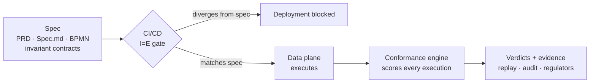

<h1 align="center">Udaykishore Resu</h1>

  <b>Principal Software Engineer</b> · Control planes and data planes in Go · AWS / GCP · Kubernetes · Spec-driven systems · LLMs in production

  

  
  
  

---

## At a glance

| | |
|---|---|
| 🧭 **Experience** | 12+ years · Capital One · NCR Voyix · Experian · CBRE · NCR · Qualcomm |
| ⚡ **Scale** | 50M+ decisions a day at sub-millisecond latency, across 50+ tenants |
| 🎛️ **Signature work** | **Intent = Execution**: a CI/CD gate and a runtime conformance engine that prove deployed behavior matches the approved spec |
| 🌐 **Open source** | Upstream pull requests to **NVIDIA**, **Kubernetes SIGs (Karpenter)** and **Open Source Risk Engine** |
| 📘 **Writing** | Author of *System Design for AI: Architecting Production-Grade LLM, RAG, Agentic, and AI Platforms* (2026) |
| 🏅 **Certified** | Google Cloud Professional Cloud Architect · AWS Solutions Architect – Associate · Anthropic Claude Certified Architect |

---

## What I do

I build the control planes that provision, authorize, govern and observe systems, and the data planes that execute them, mostly in Go, with Scala and Java where the platform calls for it. I care about systems that stay fast, secure and boring in production: the kind of infrastructure people trust without thinking about it.

This year's theme has been **Intent = Execution**: what a system does should be continuously provable against what was specified.

I also use LLMs as engineering infrastructure rather than a demo: Claude in a C++-to-Go translation and test-harness pipeline, and GPT-4 extraction in production data paths.

---

## 🌐 Open-source contributions

| Project | Contribution | Status |
|---|---|---|
| [**NVIDIA/NVSentinel**](https://github.com/NVIDIA/NVSentinel/pull/1750) | AWS Elastic Fabric Adapter (EFA) support in the NIC health monitor: discovery, link-state and degradation checks, syslog patterns. +2,377 lines across 30 files | Draft · awaiting hardware validation |
| [**kubernetes-sigs/karpenter**](https://github.com/kubernetes-sigs/karpenter/pull/3303) | Price-aware bin-packing, so mixed spot/on-demand NodePools keep a spot option instead of falling back to on-demand | In review |
| [**OpenSourceRisk/Engine**](https://github.com/OpenSourceRisk/Engine/issues/366) | Fix for American FX barriers silently priced as European in the Gaussian cross-asset model, with a regression test | In review |

---

## 🔗 Featured code

**Start here, in this order:**

1. **[payments-platform](https://github.com/udaykishore-resu/payments-platform)**: multi-tenant payment gateway in Go. Nine deployables, hexagonal, no framework. A twelve-step durable saga onboards merchants; a scored-routing orchestrator executes. *How I structure a system.*
2. **[db-migration-platform](https://github.com/udaykishore-resu/db-migration-platform)**: zero-downtime, self-verifying database migration. LSN-fenced writes, watermark-based snapshot/CDC, hierarchical digest reconciliation, and a cutover gate that is a proof rather than a checklist. *How I think about correctness.*
3. **[request-journey](https://github.com/udaykishore-resu/request-journey)**: one web request across browser, DNS, TLS, AWS, Kubernetes, data stores and observability, plus 16 failure modes, all runnable. *How I explain things.*

**More:**

| Repo | What it is |
|---|---|
| [agentgate](https://github.com/udaykishore-resu/agentgate) | Control plane for enterprise AI agents: provider-agnostic model gateway, agent identity and promotion gate, fleet observability and cost attribution |
| [specforge](https://github.com/udaykishore-resu/specforge) | Governed spec-driven engineering: a traceable graph from requirement to deployment, with a hash-chained audit trail |
| [idem](https://github.com/udaykishore-resu/idem) | Go library for idempotency keys across HTTP, gRPC and plain functions, with memory, Redis and PostgreSQL stores · on [pkg.go.dev](https://pkg.go.dev/github.com/udaykishore-resu/idem) |
| [lattice](https://github.com/udaykishore-resu/lattice) | Decision-graph engine on Scala 3 + ZIO: declarative DAGs, per-node timeouts and retries, orchestrated by AWS Step Functions |
| [zero-trust-api-gateway](https://github.com/udaykishore-resu/zero-trust-api-gateway) | Identity-aware reverse proxy in Go: JWKS-backed JWT, device binding, lock-free RBAC, sub-2ms p50 |
| [cloudoptix](https://github.com/udaykishore-resu/cloudoptix) | AWS architecture-economics prototype that attributes every dollar to the capability and decision that caused it |
| [platform-copilot](https://github.com/udaykishore-resu/platform-copilot) | The AI Engineer roadmap built as code: 127 concepts plus a Go SRE knowledge copilot that runs offline |
| [vertex-sco-platform](https://github.com/udaykishore-resu/vertex-sco-platform) | Event-driven, three-tier self-checkout edge platform in Go |
| [infoblox-ipam-operator](https://github.com/udaykishore-resu/infoblox-ipam-operator) | Kubernetes operator for CRD-based IP and DNS allocation against Infoblox, with drift detection |

---

## 🏗️ Production work

*Built inside employers, so there is no public repository. Expand any item for detail.*

<b>🎛️ Intent = Execution: conformance across control plane and data plane</b>

 

Architected a consumer decisioning platform as a **control plane** that defines intent and a **data plane** that executes it, with conformance enforced continuously across both. Speckit (spec-driven development) is the control plane's source of truth: PRD, Spec.md, BPMN process models and invariant conformance contracts give product, risk and engineering one machine-readable definition of intent. An I=E gate in the CI/CD pipeline blocks any deployment whose BPMN flows or invariants diverge from the approved spec.

The data-plane **I=E Conformance Engine** (BPMN parser, invariant evaluator, verdict producer, evidence recorder) scores every execution against its contract and writes verdicts for replay, audit and regulatory review. Governance stops being a document and becomes a test.

**Stack:** Go · BPMN · AWS CDK · CI/CD gate checks · immutable audit trail

<b>⚡ Decision Orchestrator: 50M+ decisions a day at sub-millisecond latency</b>

 

gRPC decisioning services in Go behind a BFF layer exposing REST to consumer applications, secured with mTLS and OPA-based authorization. Fronted by Decision Control Plane REST APIs with OAuth 2.0, API key and JWT auth, and per-tenant IAM policies over DynamoDB audit state. Instrumented end to end with OpenTelemetry and SLO-based paging.

**Stack:** Go · gRPC · BFF · mTLS · OPA · DynamoDB · OpenTelemetry

<b>🏗️ Multi-tenant onboarding control plane: 50+ isolated tenants</b>

 

Go control plane on AWS CDK that provisions and governs each tenant in a VPC-isolated, Route 53-routed environment. SQS/Lambda event-driven autoscaling with DLQ error isolation, locked down with KMS, IAM permission boundaries and Secrets Manager. The governance UI (conformance dashboard, invariant-breach alerting, immutable audit trail) turns tenant behavior into evidence for engineering, risk and audit.

**Stack:** Go · AWS CDK · SQS/Lambda · KMS · Route 53 · CloudWatch

<b>🧪 Graph workflow engine and Rules Lab</b>

 

Graph-based orchestration platform in Java/Spring Boot on Fargate and Step Functions, with a Graph Execution Engine that runs decisioning graphs in the data plane. **Rules Lab** lets analysts author, simulate and promote rules against the same runtime that serves production, shortening rule turnaround without a code release.

**Stack:** Java · Spring Boot · Fargate · Step Functions · Lambda

<b>🔄 C++ → Go self-checkout SDK rewrite · NCR Voyix: 30% lower latency, adoption 35% → 65%</b>

 

Directed an **8-engineer rewrite** of a legacy C++ self-checkout SDK into Go microservices on GKE, defining the service patterns for cart, POS and loyalty. Designed the BFF layer (gRPC inside, REST outside) with MQTT pub/sub and Redis-backed sessions, and mutual TLS between GKE services and POS devices under least-privilege Cloud IAM.

Brought **Claude** into the team's workflow for C++-to-Go translation, code review and test-harness generation. Reached 95% automated coverage and delivered milestones 15% ahead of schedule.

**Stack:** Go · GKE · gRPC · MQTT · Redis · Terraform · Helm · Claude

<b>🗄️ IBM DB2 → AWS Aurora zero-downtime migration · Experian: 70% faster, zero PII exposure</b>

 

Two-phase credit-data migration off the mainframe stack using SAFENET HSM-encrypted staging and Kafka/Scala CDC, secured with IAM roles, KMS CMK encryption, Direct Connect VPC routing and Splunk anomaly alerting. Rebuilt dispute processing as an async graph platform on Amazon Neptune for sub-200ms creditor-relationship lookups behind SQS/DLQ-backed REST APIs.

**Stack:** Scala · Go · Kafka/MSK · Aurora · Amazon Neptune · SAFENET HSM · Splunk

---

## 🛠️ Tech stack

   
   
  

| Area | Tools |
|---|---|
| **Cloud & IaC** | AWS (EKS, Lambda, Step Functions, DynamoDB, Aurora, Neptune, MSK) · GCP (GKE) · Terraform · AWS CDK · CloudFormation · Helm |
| **APIs & messaging** | gRPC · REST · GraphQL · MQTT · Kafka · SQS |
| **Security** | mTLS · OAuth2/OIDC · OPA · workload identity · KMS/HSM · PCI-DSS and NIST controls |
| **Observability** | OpenTelemetry · Prometheus · Grafana · Datadog · Splunk · SLO-based alerting |
| **AI engineering** | Claude · GPT-4 · LLM guardrails · agent gateways · spec-driven development |

---

## 🏅 Certifications

- Google Cloud **Professional Cloud Architect**
- AWS **Certified Solutions Architect – Associate**
- Anthropic **Claude Certified Architect**
- Programming in Golang Specialization (Coursera)
- Generative AI Fundamentals (Databricks)

---

  <i>Open to conversations about Principal/Staff platform engineering, forward-deployed and AI engineering roles, and collaborations on distributed systems.</i>

